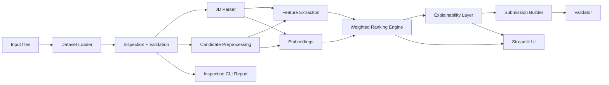

# Intelligent Candidate Discovery

Production-ready AI pipeline for ranking candidates against a job description using schema-aware parsing, semantic embeddings, explainable scoring, dataset inspection, and submission generation.

## Overview

This repository is built for a data and AI hackathon where the goal is to rank candidates against a job description and generate explainable recommendations. The codebase is organized as a modular Python application with:

- dataset loading and inspection
- job description parsing
- candidate preprocessing and feature extraction
- semantic similarity and weighted ranking
- explainability generation
- submission export and validation
- Streamlit user interface

## Architecture



### Core Modules

- `src/loaders.py` loads JSON, JSONL, CSV, and DOCX files.
- `src/inspection.py` summarizes file structure and field coverage.
- `src/inspection_cli.py` inspects an input directory and writes a markdown report.
- `src/preprocessing.py` normalizes candidate records.
- `src/jd_parser.py` extracts requirements from the job description.
- `src/feature_extractor.py` derives matching features.
- `src/embeddings.py` creates sentence-transformer embeddings.
- `src/ranking.py` combines structured and semantic scores.
- `src/explainability.py` produces readable candidate explanations.
- `src/submission.py` exports the final workbook.
- `src/validation.py` validates the generated submission.
- `src/reporting.py` builds analytics summaries for the UI.

## Repository Layout

```text
project/
├── docs/
├── output/
├── src/
├── tests/
├── app.py
├── inspect_data.py
├── main.py
├── requirements.txt
└── README.md
```

## Installation

The repository is set up for Python 3.14+ in the current workspace. The recommended workflow is to use the project virtual environment.

```bash
python -m venv .venv
.venv\Scripts\activate
python -m pip install -r requirements.txt
```

## Running the Project

### Streamlit App

```bash
streamlit run app.py
```

### Ranking Pipeline

Place the hackathon source files under `data/raw/` and run:

```bash
python main.py
```

### Dataset Inspection CLI

The inspection CLI scans an input directory, summarizes every supported file it finds, and writes a markdown report.

```bash
python inspect_data.py --input-dir data/raw --output output/inspection_report.md
```

## Dataset Notes

The repository expects the hackathon files referenced in the brief to be added locally before full ranking can run:

- `candidates.jsonl`
- `sample_candidates.json`
- `job_description.docx`
- `candidate_schema.json`
- `sample_submission.csv`
- `submission_spec.docx`
- `redrob_signals_doc.docx`
- `validate_submission.py`

## Validation

The generated submission is validated automatically after export. The project also includes a local test suite for preprocessing, parsing, ranking, validation, submission export, and dataset inspection.

```bash
python -m pytest
```

## Documentation

- [Architecture](docs/architecture.md)
- [Runbook](docs/runbook.md)
- [Dataset Inspection](docs/dataset-inspection.md)

## Status

The application code, inspection layer, and test suite are in place. The remaining work depends on the hackathon source files being available in the workspace so the pipeline can be exercised against the real dataset.