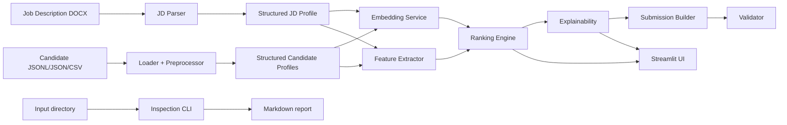

# Architecture

## System Flow

## Design Principles

- Keep parsing, preprocessing, ranking, and explanation separate.
- Make every file loader schema-agnostic so the project can tolerate hackathon data variation.
- Preserve the ranking pipeline as a pure backend workflow so the Streamlit app remains a thin UI layer.
- Use lightweight, explainable scoring on top of sentence-transformer similarity.

## Runtime Components

- `DataLoader` handles JSON, JSONL, CSV, and DOCX files.
- `DatasetInspector` summarizes file structure before the ranking pipeline runs.
- `Preprocessor` standardizes candidate records.
- `JobDescriptionParser` extracts the job requirements.
- `FeatureExtractor` computes match features.
- `EmbeddingService` produces semantic vectors.
- `RankingEngine` combines all scoring signals.
- `ExplainabilityService` creates user-facing reasons.
- `SubmissionBuilder` exports the ranking output.
- `SubmissionValidator` checks the output against the hackathon format.
- `InspectionReporter` formats file summaries for human review.

## Output Artifacts

- `output/submission.xlsx` for hackathon submission.
- `output/inspection_report.md` for dataset auditability.
- Streamlit session state for interactive ranking views.